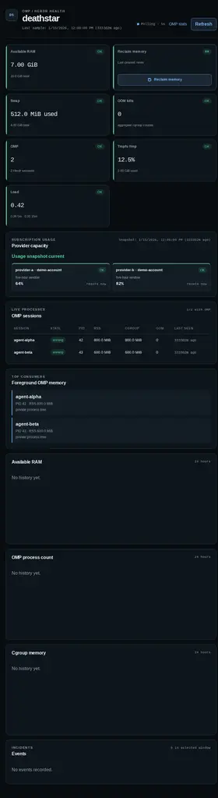
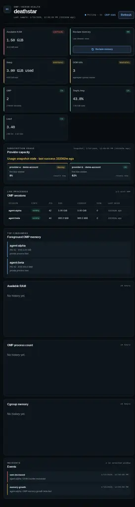
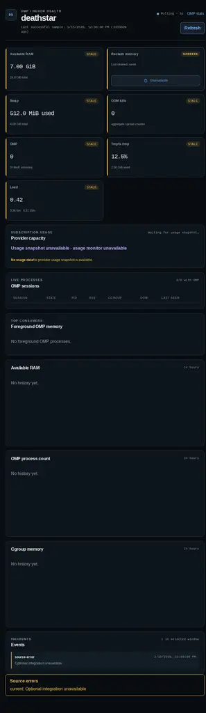
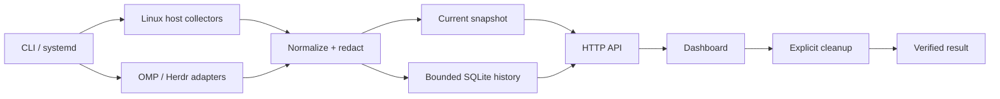

# Deathstar

Deathstar is a local-first observability dashboard for OMP/Herdr agent sessions and host memory pressure.

It reads Linux host signals, optionally enriches them with Herdr/OMP session data, stores bounded history in SQLite, and serves a loopback dashboard. It does not require a hosted service, telemetry endpoint, account, provider API key, or runtime LLM call.

## What it provides

- host memory, swap, load, tmpfs, memory-pressure, cgroup and OOM signals;
- OMP process/session state with RSS and cgroup measurements;
- normalized usage/quota cards with reset countdowns;
- bounded SQLite history and incident events;
- explicit, guarded memory cleanup with verification;
- CLI doctor output and session recovery commands;
- portable systemd user-unit and cleanup-helper templates;
- deterministic demo states for review and screenshots.

## Screenshots

The screenshots are generated from deterministic synthetic data. They never use a live host, transcript, account, or runtime database.

| Healthy | Memory pressure | Optional integration unavailable |
| --- | --- | --- |
|  |  |  |

## Quickstart

### Prerequisites

- Linux with `/proc`, cgroup v2 and `/tmp` available;
- [Bun](https://bun.sh/) 1.x;
- optional: local `herdr` and `omp` installations for session and usage data.

```bash
bun install --frozen-lockfile
bun run dev
```

Open <http://127.0.0.1:3848/>. The default bind is loopback. The first sample is written below `${XDG_STATE_HOME:-$HOME/.local/state}/deathstar/monitor.sqlite3`.

The host collector is required for a useful snapshot. Herdr/OMP is optional: if its binary is missing or its output is malformed, Deathstar keeps the host cards available and marks the integration unavailable.

### Deterministic demo

Use the demo server to inspect the real dashboard without reading the host or writing a runtime database:

```bash
DEATHSTAR_DEMO_STATE=healthy bun run demo
DEATHSTAR_DEMO_STATE=pressure bun run demo
DEATHSTAR_DEMO_STATE=unavailable bun run demo
```

The demo binds to <http://127.0.0.1:3850/> by default. Set `DEATHSTAR_DEMO_PORT` or `DEATHSTAR_DEMO_HOST` to change it. The three states are fixed in `scripts/demo-data.ts` and use synthetic sessions, providers and timestamps.

## Runtime flow



1. Collect host and optional integration signals in parallel.
2. Keep unavailable optional integrations as explicit unknown/unavailable state.
3. Normalize values into stable TypeScript types.
4. Redact paths, command payloads and unbounded diagnostic text before persistence.
5. Persist bounded snapshots/events and expose current state through HTTP.
6. Let the dashboard show trends, incidents, usage and cleanup readiness.
7. Require an explicit same-origin cleanup request; report the helper result and post-action measurements.

See [the architecture guide](docs/architecture.md) and [the operator flows](docs/flows.md).

## HTTP API

All endpoints are served by the local HTTP server:

| Endpoint | Method | Purpose |
| --- | --- | --- |
| `/healthz` | GET | database and collector freshness |
| `/api/current` | GET | current snapshot plus recent events |
| `/api/history?range=1h\|6h\|24h` | GET | bounded history points |
| `/api/events?range=1h\|6h\|24h` | GET | incident events |
| `/api/usage` | GET | normalized usage and model metadata |
| `/api/maintenance` | GET | cleanup helper readiness |
| `/api/memory/cleanup` | POST | explicit cleanup; requires the configured dashboard `Origin` and no request body |

The cleanup endpoint is intentionally not a generic command runner. It invokes only the configured helper through `sudo -n`, validates the versioned JSON result, enforces a cooldown, and returns a safe error when authorization or the helper is unavailable.

## OMP and Herdr integration

Deathstar discovers Herdr sessions with the configured `herdr` binary and reads the session snapshot and pane process tree. Usage normalization invokes:

- `omp usage --json --redact`;
- `omp models --json`.

Configure a non-default Herdr binary with `DEATHSTAR_HERDR=/absolute/path/to/herdr`. Missing binaries are non-fatal. Detailed command contracts and recovery behavior live in [docs/integrations/omp-herdr.md](docs/integrations/omp-herdr.md).

The local session CLI is available through the wrapper:

```bash
bin/deathstar doctor --json
bin/deathstar session bind agent-alpha
bin/deathstar session status agent-alpha
bin/deathstar session close agent-alpha
bin/deathstar session open agent-alpha --no-attach
```

Session mappings are stored below `${XDG_STATE_HOME:-$HOME/.local/state}/deathstar/recovery`. OMP transcript paths are read for local recovery, but never persisted through the dashboard storage boundary.

## Configuration and safe defaults

| Variable | Default | Meaning |
| --- | --- | --- |
| `DEATHSTAR_HOST` | `127.0.0.1` | bind address |
| `DEATHSTAR_PORT` | `3848` | HTTP port |
| `DEATHSTAR_DB` | `${XDG_STATE_HOME:-$HOME/.local/state}/deathstar/monitor.sqlite3` | absolute SQLite path |
| `DEATHSTAR_DASHBOARD_ORIGIN` | `http://127.0.0.1:<port>` | allowed cleanup request origin |
| `DEATHSTAR_HERDR` | `herdr` | Herdr executable |
| `DEATHSTAR_SAMPLE_MS` | `5000` | host/session sample interval |
| `DEATHSTAR_RETENTION_MS` | `86400000` | history retention |
| `DEATHSTAR_COMMAND_TIMEOUT_MS` | `2000` | local command timeout |
| `DEATHSTAR_MEMORY_HELPER` | `/usr/local/libexec/deathstar-memory-clean` | cleanup helper path |
| `DEATHSTAR_AUTO_CLEANUP` | `off` | `off` or `cache`; off is the public default |
| `DEATHSTAR_MEMORY_GROWTH_BYTES` | `536870912` | growth-event threshold |
| `DEATHSTAR_MEMORY_GROWTH_WINDOW_MS` | `300000` | growth-event window |

Threshold, usage, cleanup and state-stabilization variables are documented in [docs/architecture.md](docs/architecture.md). Configured filesystem paths and state roots must be absolute.

## Cleanup safety model

Cleanup is optional and disabled until the root-owned helper and validated sudoers rule are installed. The public service unit keeps automatic cleanup off. The dashboard action:

- accepts only a same-origin `POST` with an empty body;
- refuses concurrent runs and enforces a cooldown;
- invokes `sudo -n` so it cannot hang on a password prompt;
- validates the helper's versioned JSON response;
- displays page-cache and swap actions separately;
- exposes before/after verification metrics.

Install the optional helper from an interactive terminal only:

```bash
sudo ops/install-memory-cleanup
```

Readiness is visible in the dashboard and via `bin/deathstar doctor --json`.

## Development

```bash
bun install --frozen-lockfile
bun test
bun run typecheck
bun run build:web
```

The tests use synthetic `/proc`, cgroup, command and session fixtures. Do not replace them with real transcripts, provider payloads, host paths or account data.

## Privacy boundary

The default process is local-only and loopback-bound. Deathstar does not send telemetry or call an LLM at runtime. SQLite/API snapshots store normalized public fields; raw prompts, transcripts, tokens, provider responses, cgroup paths, command output and workstation-specific paths must not cross the persistence boundary.

Do not expose the loopback server directly to a network without adding an authentication and transport boundary outside this repository. See [SECURITY.md](SECURITY.md).

## Repository guides

- [AGENTS.md](AGENTS.md) — coding-agent and contributor contract;
- [docs/architecture.md](docs/architecture.md) — module ownership and data flow;
- [docs/flows.md](docs/flows.md) — first-run, incident and degraded-integration flows;
- [docs/integrations/omp-herdr.md](docs/integrations/omp-herdr.md) — command contracts and recovery;
- [docs/llm-context.md](docs/llm-context.md) — compact machine-readable context;
- [CONTRIBUTING.md](CONTRIBUTING.md) — change workflow;
- [SECURITY.md](SECURITY.md) — disclosure and local safety model.

## License

MIT. See [LICENSE](LICENSE).
