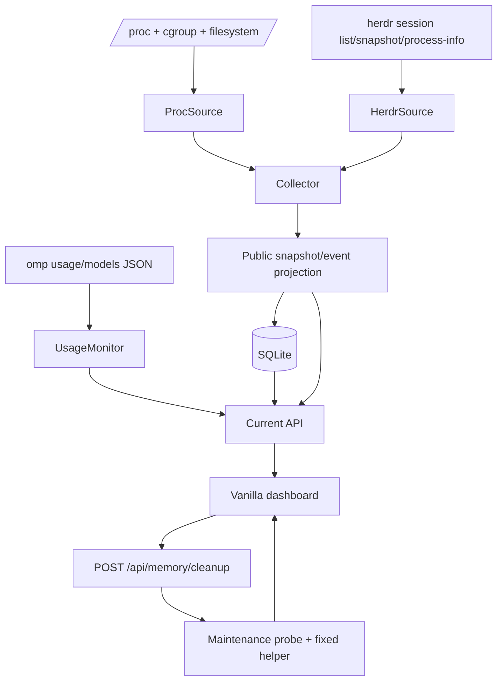

# Architecture

Deathstar is a single Bun process with a collector loop, a usage monitor, SQLite storage and a static dashboard served by the same HTTP listener.

## Request and data flow



## Runtime ownership

| Module | Owns | Must not do |
| --- | --- | --- |
| `src/config.ts` | validated env values and defaults | accept relative filesystem paths or unsafe origins |
| `src/paths.ts` | HOME/XDG-derived absolute state roots | encode a machine-specific path |
| `src/sources/proc.ts` | Linux memory, swap, load, pressure, filesystem and cgroup reads | expose raw `/proc` errors as public payloads |
| `src/sources/herdr.ts` | Herdr session list, snapshots, pane process trees and OMP correlation | make Herdr availability a startup prerequisite |
| `src/usage.ts` | `omp usage --json --redact`, model catalog and CLI-provider normalization | persist raw command output or account identity |
| `src/collector.ts` | parallel host/integration collection, host-state stabilization, OOM/PID/growth events | silently turn an integration failure into healthy data |
| `src/privacy.ts` | public projections for snapshots and events | become an optional caller-controlled step |
| `src/storage.ts` | schema, transactions, history aggregation, retention | store an unprojected snapshot/event |
| `src/http.ts` | loopback server, API routes, origin/body checks and static assets | accept arbitrary commands or cleanup origins |
| `src/maintenance.ts` | helper file/ownership/readiness probe | claim readiness without root ownership and sudo authorization |
| `src/memory-cleanup.ts` | guarded helper invocation, JSON validation and cooldown | run interactively or accept arbitrary arguments |
| `src/recovery/` | local session mapping and safe OMP resume/close flow | use a mapping outside the configured session root |
| `web/` | presentation, polling, charts, retry and accessible state messages | render raw command payloads |

## Collector semantics

Host and Herdr collection runs with `Promise.allSettled`. A host-source failure rejects the sample because the dashboard has no trustworthy host state. A Herdr-source failure produces:

- an empty session list;
- `collectorErrors: ["Herdr integration unavailable"]`;
- a `source-error` warning event;
- a usable host snapshot and HTTP response.

Host health state is stabilized across configurable samples. Escalation and recovery have separate confirmation counts so a single noisy read does not flap the dashboard. Memory-growth events compare a session's RSS baseline by PID and time window. OOM events compare host and cgroup counters and mark shared cgroups as aggregate events.

## Persistence and retention

`src/storage.ts` creates these SQLite tables:

- `samples`: public host snapshot payload plus indexed aggregate values;
- `session_samples`: public per-session payload and aggregate RSS/OOM values;
- `events`: public event kind, severity, session and whitelisted details.

Snapshots and events pass through `src/privacy.ts` inside the storage methods. History is bucketed into five-minute points outside the most recent hour; recent rows remain at sample resolution. `prune(before)` removes old rows from all three tables.

The default database directory is created with mode `0700`. The database path must be absolute.

## Public projection

The public snapshot projection preserves health and aggregate process data while replacing or dropping sensitive fields:

- session directory, pane ID and cgroup path become `null`;
- process cwd becomes `null`;
- process command becomes only the executable basename;
- host/session error text becomes generic unavailable text;
- collector errors become generic optional-integration text.

The event projection replaces free-form messages with fixed messages per event kind and keeps only numeric counters, timing, shared-cgroup, source and status fields. Add a field to the whitelist only when it is demonstrably safe and covered by a focused test.

## Configuration reference

The important defaults are:

```text
DEATHSTAR_HOST=127.0.0.1
DEATHSTAR_PORT=3848
DEATHSTAR_DB=${XDG_STATE_HOME:-$HOME/.local/state}/deathstar/monitor.sqlite3
DEATHSTAR_DASHBOARD_ORIGIN=http://127.0.0.1:<port>
DEATHSTAR_HERDR=herdr
DEATHSTAR_SAMPLE_MS=5000
DEATHSTAR_USAGE_INTERVAL_MS=3600000
DEATHSTAR_USAGE_TIMEOUT_MS=60000
DEATHSTAR_RETENTION_MS=86400000
DEATHSTAR_COMMAND_TIMEOUT_MS=2000
DEATHSTAR_MEMORY_HELPER=/usr/local/libexec/deathstar-memory-clean
DEATHSTAR_AUTO_CLEANUP=off
```

Additional controls include:

- `DEATHSTAR_WARNING_AVAILABLE_BYTES` / `DEATHSTAR_CRITICAL_AVAILABLE_BYTES`;
- `DEATHSTAR_WARNING_SWAP_RATIO`;
- `DEATHSTAR_STATE_CONFIRM_SAMPLES` / `DEATHSTAR_STATE_RECOVERY_SAMPLES`;
- `DEATHSTAR_MEMORY_GROWTH_BYTES` / `DEATHSTAR_MEMORY_GROWTH_WINDOW_MS`;
- `DEATHSTAR_MEMORY_TIMEOUT_MS` / `DEATHSTAR_MEMORY_COOLDOWN_MS`;
- `DEATHSTAR_AUTO_CLEANUP_COOLDOWN_MS`;
- `DEATHSTAR_RECOVERY_DIR` and `DEATHSTAR_SESSION_ROOT` for local recovery state.

Invalid integers, origins and relative paths fail during config loading rather than being repaired silently.

## HTTP contract

- `GET /healthz` reports database status and whether the latest snapshot is at most 15 seconds old.
- `GET /api/current` returns `{ snapshot, events }`; snapshot may be `null` before the first sample.
- `GET /api/history?range=1h|6h|24h` returns bounded history points.
- `GET /api/events?range=1h|6h|24h` returns newest events first.
- `GET /api/usage` returns normalized usage or an explicit unknown response.
- `GET /api/maintenance` reports helper readiness.
- `POST /api/memory/cleanup` requires `Origin === DEATHSTAR_DASHBOARD_ORIGIN`, no body and a configured cleanup controller.

All JSON responses use `cache-control: no-store`. Unknown optional data remains visible to the operator instead of being hidden behind an empty success state.
