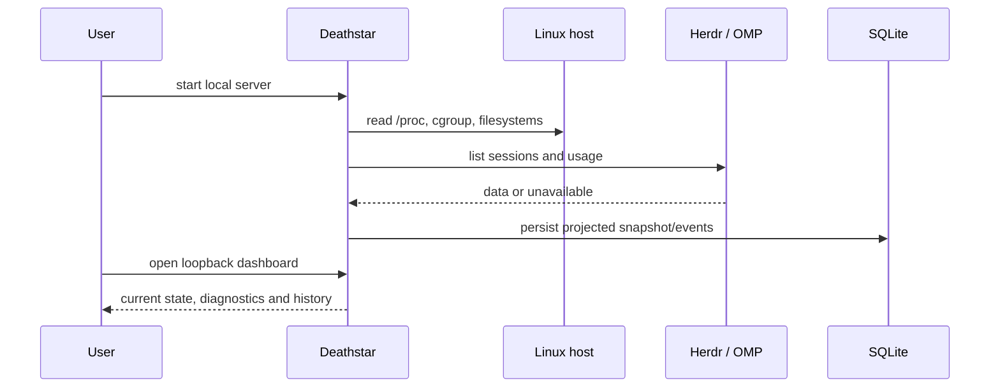
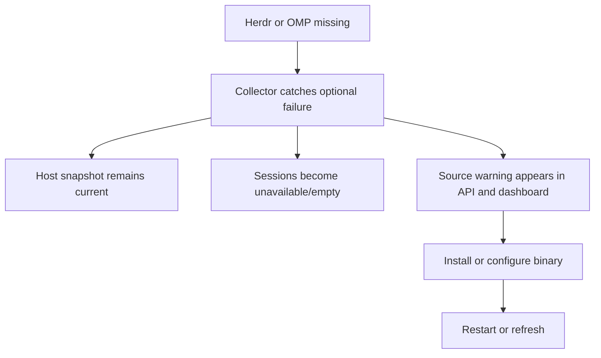
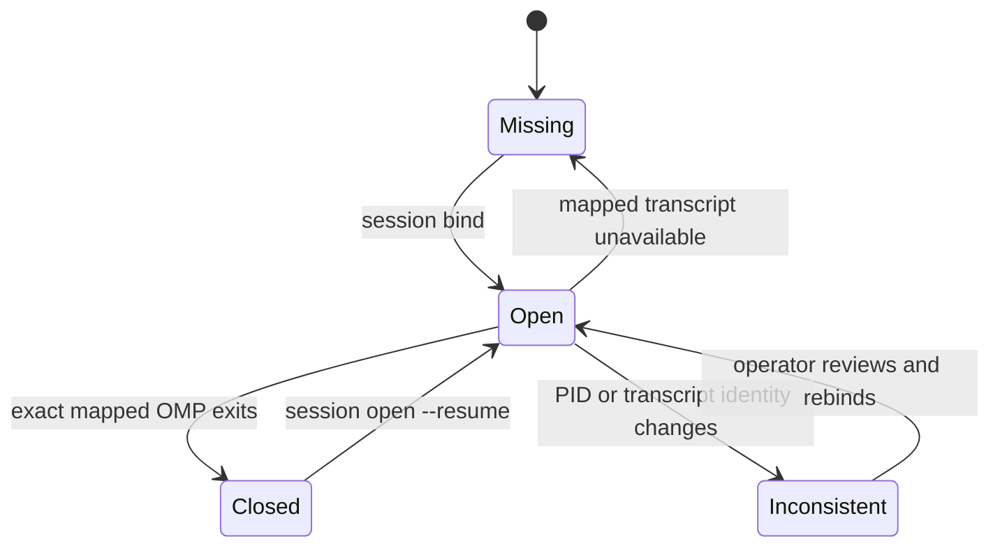

# Operator flows

## First run

1. Install dependencies with `bun install --frozen-lockfile`.
2. Start `bun run dev` and open `http://127.0.0.1:3848/`.
3. Run `bin/deathstar doctor --json` to inspect cleanup readiness, service state and `/healthz` reachability.
4. Add `DEATHSTAR_HERDR` only when the local binary is not on `PATH`.
5. Confirm host cards and optional-integration status before installing cleanup or enabling any automation.

## Incident observation

1. The top cards show available RAM, swap, load, tmpfs, cgroup memory, OOM and OMP count.
2. The sessions table shows normalized session/process state and aggregate memory.
3. Usage cards show provider/model capacity and reset countdowns without raw account data.
4. Charts and events expose bounded trends, PID changes, OOM increases and memory growth.
5. The operator can press the explicit cleanup action only after readiness is visible.
6. The result shows each action and before/after measurements; a failure remains visible with remediation.

## Degraded optional integration

Deathstar must start without `herdr`. The host collector still runs. The dashboard shows the optional source warning and keeps retry controls available. No migration or database reset is needed after the binary becomes available.

## Explicit cleanup

1. Install and validate the helper from an interactive terminal with `sudo ops/install-memory-cleanup`.
2. Confirm `bin/deathstar doctor --json` reports authorization `ready`.
3. Press the dashboard cleanup action or send the same-origin bodyless `POST`.
4. Deathstar refuses an overlapping run, password prompt or cooldown violation.
5. The helper returns versioned JSON with page-cache and swap action states.
6. Deathstar renders the result and records the last cleanup status in the maintenance view.

Automatic cleanup is `off` by default and remains off in the public service unit.

## Recovery flow

Recovery mapping is local operator state. `bind` records the exact session file, pane, PID, start time and file metadata. `close` checks the mapped PID/start identity before sending the exit key. `open` validates the mapped transcript is inside the configured OMP session root, restores it in the mapped Herdr pane, then rechecks identity.
